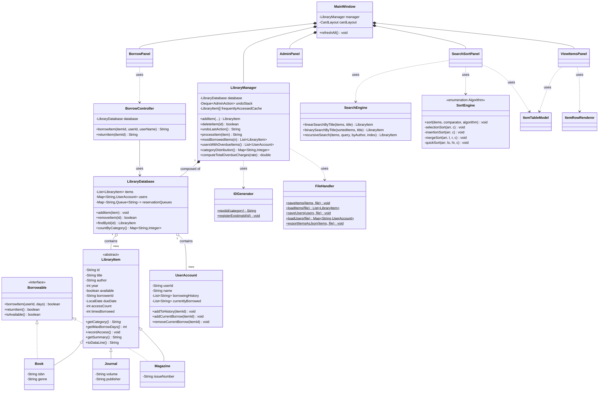

# SLCAS — UML Class Diagram

Paste the block below into the [Mermaid Live Editor](https://mermaid.live) or view it directly
in VS Code / IntelliJ with a Mermaid preview plugin to render the diagram. Export the rendered
image (PNG/SVG) for your submission.

## Notes on the design

- **Abstraction & polymorphism**: `LibraryItem` is abstract; `getCategory()` and
  `getMaxBorrowDays()` are overridden differently by `Book`, `Magazine`, and `Journal`.
  `LibraryManager.processItem(LibraryItem item)` operates on the abstract type and behaves
  differently at runtime depending on the concrete subclass passed in — the required
  polymorphic function.
- **Interface**: `Borrowable` is implemented only by `Book` and `Magazine`. `Journal` is
  deliberately excluded to model reference-only items — this makes `instanceof Borrowable`
  checks in `BorrowController` and `LibraryManager` meaningful rather than a rubber stamp.
- **Composition**: `LibraryDatabase` is composed of collections of `LibraryItem` and
  `UserAccount`; `LibraryManager` is composed of a `LibraryDatabase`.
- **Package layout** mirrors the required structure: `model`, `controller`, `gui`, `utils`.
